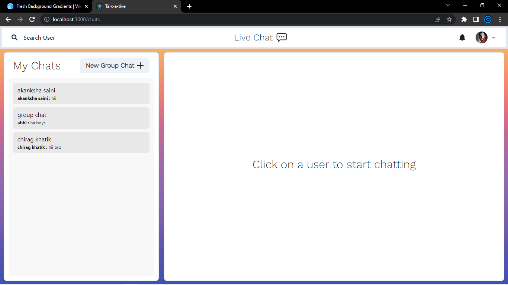

# LiveChatApp
LiveChat is a Full Stack Chatting App. Uses Socket.io for real time communication and stores user details in encrypted format in Mongo DB Database.

# Tech Stack

Client: React JS

Server: Node JS, Express JS

Database: Mongo DB

# Features

<h2>Authentication</h2>

<h3>Login</h3>

<h3>Signup</h3>

 
<h2>Real Time Chatting with Typing indicators</h2>

 
<h2>One on One Chat</h2>

 
<h2>Search Users</h2>

 
<h2>Create Group Chat</h2>

 
<h2>Notification</h2>

 
<h2>User Profile</h2>

